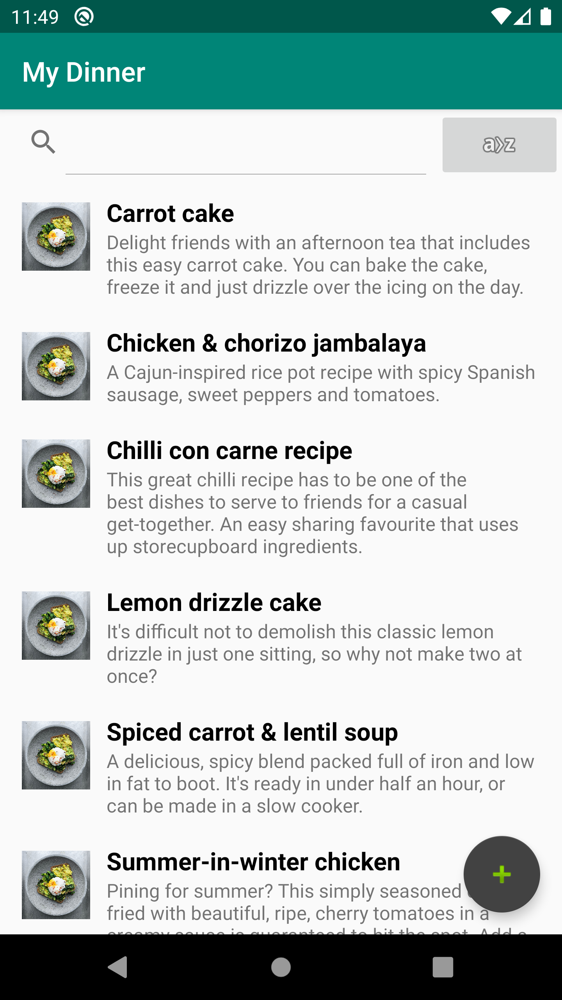

# My Dinner

## Description

My Dinner is a recipe management Android app made during "Object-Oriented Technology 2" classes (AGH, VI summer semester 2019/20).

## Functions

- User sign-up & login
- Network error handling
- Adding new recipes with:
  - title
  - description
  - ingredients
- Sorting recipe list alphabetically
- Searching recipes by title
- Displaying recipes

## Technologies

- Android
- Kotlin
- Gradle
- Fuel
- Gson

## Screenshots

<figure>

 
<figcaption><b>Figure 1. Start screen.</b></figcaption>
</figure>
 
 
 

<figure>

 
<figcaption><b>Figure 2. User sign-up.</b></figcaption>
</figure>
 
 
 

<figure>

 
<figcaption><b>Figure 3. Recipe list.</b></figcaption>
</figure>
 
 
 

<figure>

 
<figcaption><b>Figure 4. Recipe list sorted.</b></figcaption>
</figure>
 
 
 

<figure>

 
<figcaption><b>Figure 5. Recipe list search.</b></figcaption>
</figure>
 
 
 

<figure>

 
<figcaption><b>Figure 6. Creating new recipe.</b></figcaption>
</figure>
 
 
 

<figure>

 
<figcaption><b>Figure 7. Recipe view.</b></figcaption>
</figure>
 
 
 

